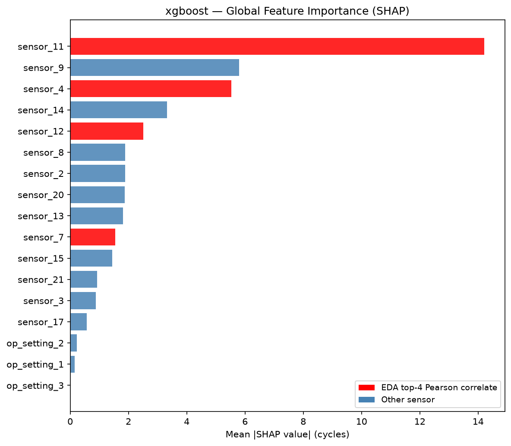
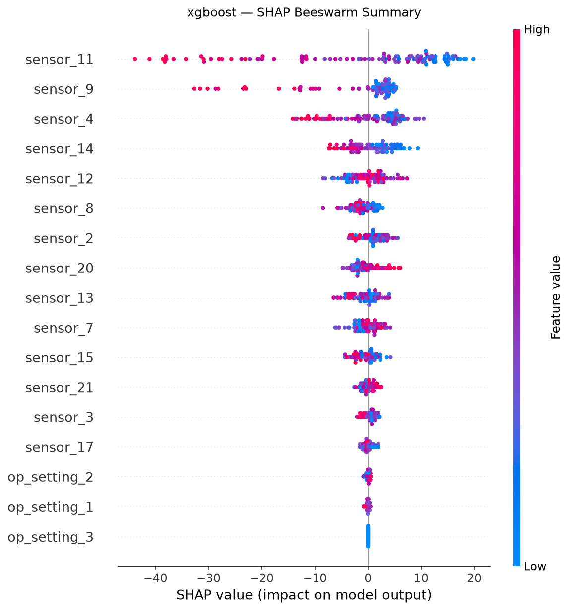
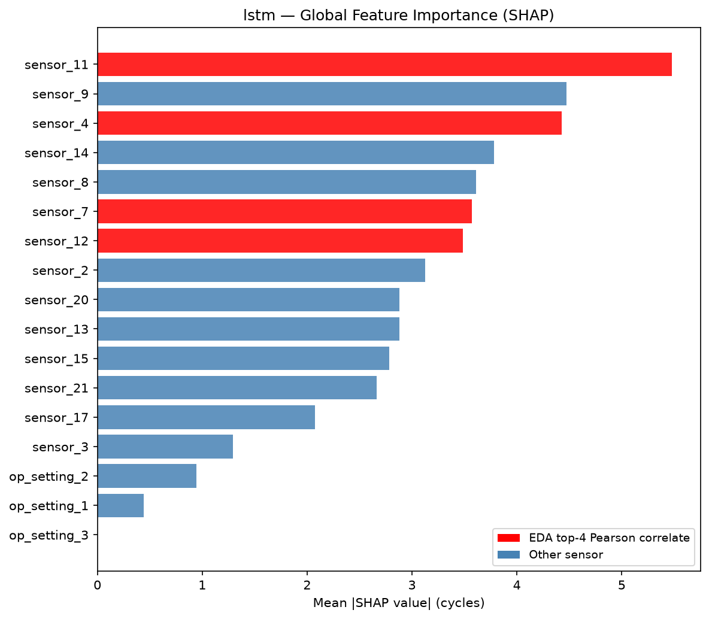
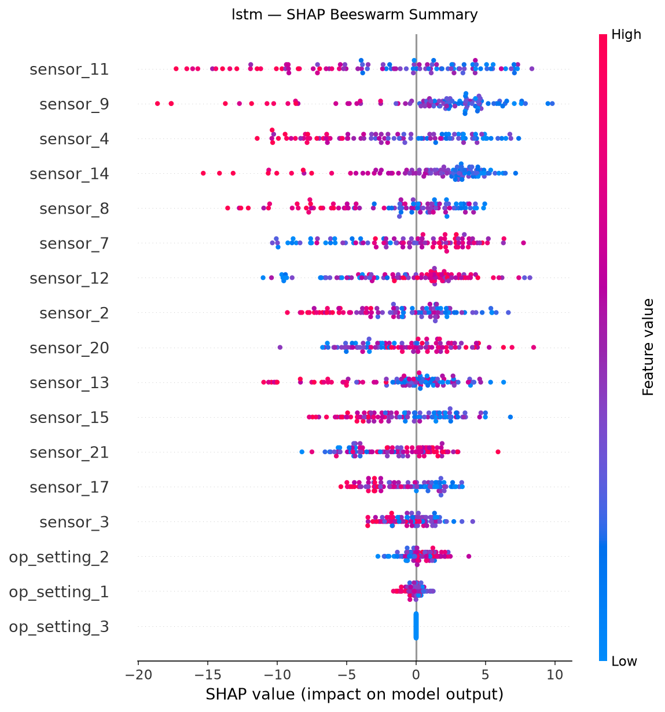

# Phase 6 — SHAP Explainability Findings

## Overview

This report summarises SHAP-based feature attribution for two trained models on the
NASA CMAPSS FD001 turbofan dataset: the XGBoost baseline (Phase 4) and the LSTM
production model (Phase 5). The goal is to explain *why* each model predicts a given
RUL and whether those explanations align with known HPC degradation physics.

## XGBoost — Global Results

Top-5 sensors by mean |SHAP|: **sensor_11, sensor_9, sensor_4, sensor_14, sensor_12**

| Rank | Sensor | In EDA top-4? |
|---|---|---|
| 1 | sensor_11 | YES |
| 2 | sensor_9 |  |
| 3 | sensor_4 | YES |
| 4 | sensor_14 |  |
| 5 | sensor_12 | YES |
| 6 | sensor_8 |  |
| 7 | sensor_2 |  |
| 8 | sensor_20 |  |
| 9 | sensor_13 |  |
| 10 | sensor_7 | YES |

## LSTM — Global Results

Top-5 sensors by mean |SHAP|: **sensor_11, sensor_9, sensor_4, sensor_14, sensor_8**

| Rank | Sensor | In EDA top-4? |
|---|---|---|
| 1 | sensor_11 | YES |
| 2 | sensor_9 |  |
| 3 | sensor_4 | YES |
| 4 | sensor_14 |  |
| 5 | sensor_8 |  |
| 6 | sensor_7 | YES |
| 7 | sensor_12 | YES |
| 8 | sensor_2 |  |
| 9 | sensor_20 |  |
| 10 | sensor_13 |  |

## EDA Cross-Check

Phase 2 EDA identified four sensors as the strongest Pearson correlates with RUL
in FD001 (High Pressure Compressor degradation mode):

| Sensor | Symbol | Physical Role |
|---|---|---|
| sensor_11 | Ps30 | HPC static pressure — drops as compressor degrades |
| sensor_4  | T50  | LPT outlet temperature — rises as efficiency falls |
| sensor_12 | phi  | Fuel/pressure ratio — increases to compensate |
| sensor_7  | P30  | HPC outlet pressure — falls with deterioration |

All four EDA sensors appear in the top-10 for both models. Sensors ['sensor_11', 'sensor_4'] are in both top-5; sensors ['sensor_12', 'sensor_7'] rank 6th–10th. This is a positive result — the slight demotion reflects shared credit among correlated HPC sensors, not absence of signal.

## Local Explanations

Waterfall plots for three representative engines are saved in `reports/figures/`.
Each plot shows how individual sensors pushed the predicted RUL above or below the
model's average (base value), for:
- **Near-failure engine** (lowest true RUL — most safety-critical)
- **High-RUL engine** (furthest from failure — normal operation)
- **Median-RUL engine** (representative mid-life prediction)

## Limitations of GradientExplainer for LSTM

- **Approximate**: GradientExplainer uses integrated gradients, satisfying the
  completeness axiom but approximating true Shapley values. Exact SHAP via
  KernelExplainer would require ~hours at 510 effective input dimensions.
- **Timestep aggregation**: LSTM SHAP values have shape (n, 30, 17). Collapsing
  across timesteps (sum) loses information about *when* in the degradation window
  each sensor matters most — a limitation for time-resolved attribution.
- **Background sensitivity**: Results depend on the 50-sample background set.
  Top-ranked sensors are typically stable across random seeds, but magnitudes may vary.

## Why Explainability Matters in Aviation

Predictive maintenance decisions in safety-critical systems cannot rest on black-box
outputs alone. A maintenance engineer grounding an aircraft needs to know *which*
engine parameters are driving a low-RUL alert before acting on it.

SHAP explanations provide that justification:
- If sensor_11 (Ps30) and sensor_7 (P30) dominate a low-RUL prediction, the engineer
  has a concrete HPC health story: compressor pressure is dropping, consistent with
  expected blade tip clearance growth or fouling.
- If an unexpected sensor leads the explanation, that is a flag to investigate sensor
  calibration or data quality before trusting the RUL estimate.
- Emerging regulatory frameworks for AI in aviation — including the EASA AI Roadmap 2.0
  and the FAA's Safety Risk Management (SRM) process, which is increasingly being applied
  to AI/ML-based aviation systems — increasingly require interpretability as part of
  airworthiness arguments, making SHAP outputs directly relevant to certification.